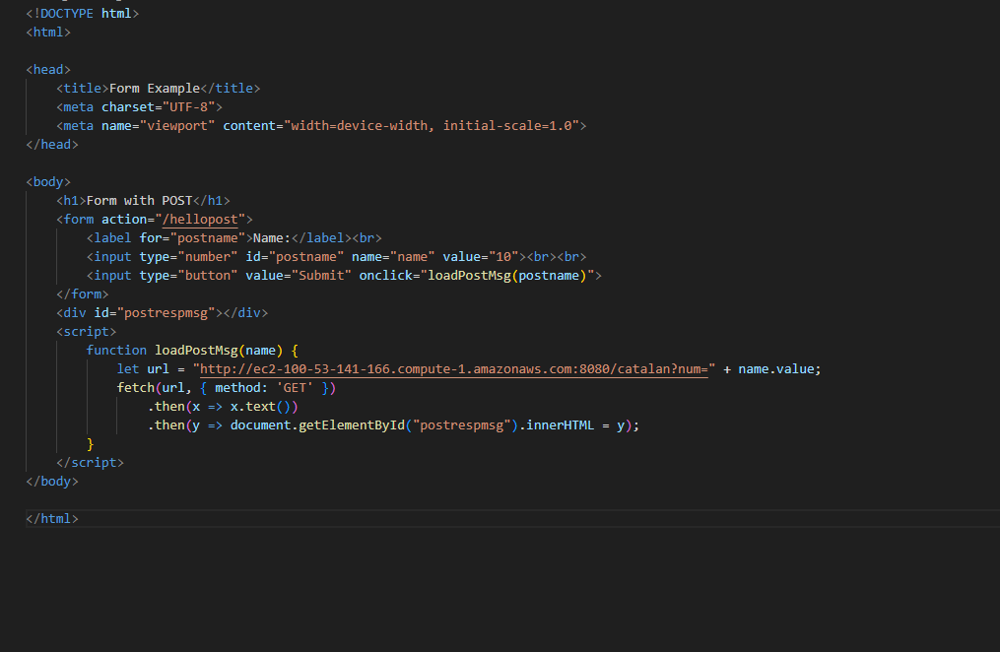

# ParcialTDSEProxy

Recibe la peticion y la manda a la primera instancia, si esta no responde o ocurre un error manda la peticion a la segunda instancia.

El index.html final apuntaba al proxy para su funcionamiento.
